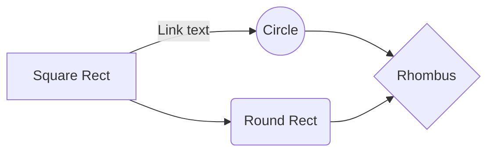

# mkdocs相关

MkDocs是一个强大且易于使用的文档框架，在使用其社区开发的插件时会变得更好。本文展示了一些最好的定制选项和插件，例如图表、代码参考、笔记本集成、宏、PDF生成等。

在探索插件之前，让我们从一些常规的mkdocs特性开始。对于许多MkDocs用户来说，mkdocs-material已经成为事实上的标准主题。最近的更新增加了对多个文档版本的支持，亮/暗模式切换等。

mkdocs-material集成了pymkdown扩展，它允许您添加标签式代码块，进度条，任务列表，键盘符号等。

MkDocs及其插件的最大优点是使用和配置非常简单。您不需要了解任何关于前端开发的知识，就可以在几分钟内构建一个漂亮的文档。

任何markdown文件都允许您直接在markdown文本中添加HTML代码。即使你不知道任何HTML，这对于扩展markdown的格式选项（有点有限）也很方便。例如，一个简单的<br>标签将添加空白段落。更进一步，您可以将API引用直接添加到文档中。

## Mermaid graphs
mkdocs-mermaid 2插件允许您通过简单的语法直接在markdown文件中创建Mermaid图。图表、图表和样式有多种选择，例如：流、甘特、饼图、关系、序列等。

效果图如下：


插件地址：[mkdocs-mermaid2-plugin](https://github.com/fralau/mkdocs-mermaid2-plugin#declaring-the-superfences-extension)

样例如下:

    ```mermaid
    graph LR
        A[Square Rect] -- Link text --> B((Circle))
        A --> C(Round Rect)
        B --> D{Rhombus}
        C --> D
    ```




安装：
```bash
pip install mkdocs-mermaid2-plugin
```

如果你想使用`mermaids `插件并激活superfences扩展，请注意[此配置](https://github.com/fralau/mkdocs-mermaid2-plugin#declaring-the-superfences-extension)。

配置如下：
```yaml
markdown_extensions:
  - pymdownx.superfences:
      custom_fences:
        - name: mermaid
          class: mermaid
          format: !!python/name:pymdownx.superfences.fence_code_format ''
```

## Jupyter notebook集成：
mkdocs-jupyter和mknotebooks 让你集成Jupyter笔记本，就像一个markdown文件。默认情况下，包括输出单元格在内的笔记本电脑的当前状态是积分的。这两个插件还提供了在构建文档时从头开始执行notebook的选项。

效果图如下：


插件地址：[mkdocs-jupyter](https://github.com/danielfrg/mkdocs-jupyter)

安装：
```bash
pip install mkdocs-jupyter
```

配置示例如下：
```yaml

nav:
  - Home: index.md
  - Notebook page: notebook.ipynb
  - Python file: python_script.py

plugins:
  - mkdocs-jupyter
```

## 更多推荐插件


也可以在Github项目页面上查看MkDocs插件的完整列表。

-   [**mkdocs-monorepo-plugin**](https://github.com/backstage/mkdocs-monorepo-plugin)**:**在单个存储库中构建多组文档。
-   [**mkdocs-pdf-export-plugin**](https://github.com/zhaoterryy/mkdocs-pdf-export-plugin)**:** 将文档导出为PDF。
-   [**mkdocs-table-reader-plugin**](https://github.com/timvink/mkdocs-table-reader-plugin)**:**以表格形式插入CSV文件。
-   [**mkdocs-autolinks-plugin**](https://github.com/midnightprioriem/mkdocs-autolinks-plugin)**:** 简化章节之间的相对连接。
-   [**mkdocs-redirects**](https://github.com/datarobot/mkdocs-redirects)**:** 页面重定向为移动/重命名的页面。
-   [**mkdocs-exclude**](https://github.com/apenwarr/mkdocs-exclude): 排除选定的文件或模式，例如配置文件。
-   [**mkdocs-exclude-search**](https://github.com/chrieke/mkdocs-exclude-search)**:**从搜索索引中排除选定的文件或节。
-   [**MkDocsPlus**](http://bwmarrin.github.io/MkDocsPlus/)**:** MkDocs支持第三方JavaScript库，例如Flowchart.js、DataTables、Charts.js等


## 参考链接

- [The best MkDocs plugins and customizations](https://chrieke.medium.com/the-best-mkdocs-plugins-and-customizations-fc820eb19759)