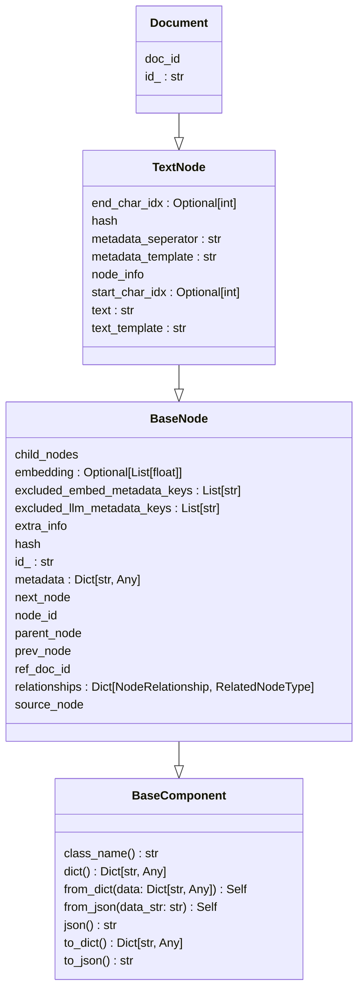

# 生成Python类图

在 pylint 中，pyreverse 命令可以分析源代码并生成包和类图。

首先需要安装 pylint：

```bash
pip install pylint
```

pyreverse 用法说明如下：
```bash
$ pyreverse -h
使用方法：pyreverse [选项]

为<包>中的类和模块创建UML图。

选项：
  -h, --help            显示此帮助信息并退出

Pyreverse：
  为pyreverse命令提供公共行为的基类。

  --filter-mode <mode>, -f <mode>
                        根据模式过滤属性和函数。<mode>的正确模式有：'PUB_ONLY' 过滤所有非公共属性[默认]，等同于PRIVATE+SPECIAL_A 'ALL' 不过滤
                        'SPECIAL' 过滤Python特殊函数，不包括构造函数 'OTHER' 过滤受保护和私有的属性（默认：PUB_ONLY）
  --class <class>, -c <class>
                        创建一个类图，包含与<class>相关的所有类；这默认使用选项-ASmy（默认：[]）
  --show-ancestors <ancestor>, -a <ancestor>
                        显示<ancestor>代祖先类，这些类不在<项目>中（默认：None）
  --all-ancestors, -A   显示<项目>中所有类的所有祖先（默认：None）
  --show-associated <association_level>, -s <association_level>
                        显示<association_level>级别的相关类，这些类不在<项目>中（默认：None）
  --all-associated, -S  递归显示所有相关类的所有相关类（默认：None）
  --show-builtin, -b    在类的表示中包括内置对象（默认：False）
  --show-stdlib, -L     在类的表示中包括标准库对象（默认：False）
  --module-names <y or n>, -m <y or n>
                        在类的表示中包括模块名称（默认：None）
  --only-classnames, -k
  --output-directory <output_directory>, -d <output_directory>
                        设置输出目录路径。（默认：）
  --source-roots <path>[,<path>...]
                        添加路径到源根列表中。支持通配符模式。源根是一个绝对路径或相对于当前工作目录的路径，用于确定位于源根下的模块的包命名空间。（默认：（））
  --verbose             使pyreverse更详细/健谈。主要用于调试。（默认：False）
```


假设我有一个名为 test.py 的文件，这里使用 llama_index 中的代码为例：
```python

import json
import textwrap
import uuid
from abc import abstractmethod
from dataclasses import dataclass
from enum import Enum, auto
from hashlib import sha256
from io import BytesIO
from typing import TYPE_CHECKING, Any, Dict, List, Optional, Union

from dataclasses_json import DataClassJsonMixin
from llama_index.core.bridge.pydantic import BaseModel, Field
from llama_index.core.utils import SAMPLE_TEXT, truncate_text
from typing_extensions import Self


from haystack.schema import Document as HaystackDocument
from llama_index.core.bridge.langchain import Document as LCDocument
from semantic_kernel.memory.memory_record import MemoryRecord


class BaseComponent(BaseModel):
    """Base component object to capture class names."""

    class Config:
        @staticmethod
        def schema_extra(schema: Dict[str, Any], model: "BaseComponent") -> None:
            """Add class name to schema."""
            schema["properties"]["class_name"] = {
                "title": "Class Name",
                "type": "string",
                "default": model.class_name(),
            }

    @classmethod
    def class_name(cls) -> str:
        """
        Get the class name, used as a unique ID in serialization.

        This provides a key that makes serialization robust against actual class
        name changes.
        """
        return "base_component"

    def json(self, **kwargs: Any) -> str:
        return self.to_json(**kwargs)

    def dict(self, **kwargs: Any) -> Dict[str, Any]:
        data = super().dict(**kwargs)
        data["class_name"] = self.class_name()
        return data

    def __getstate__(self) -> Dict[str, Any]:
        state = super().__getstate__()

        # tiktoken is not pickleable
        # state["__dict__"] = self.dict()
        state["__dict__"].pop("tokenizer", None)

        # remove local functions
        keys_to_remove = []
        for key, val in state["__dict__"].items():
            if key.endswith("_fn"):
                keys_to_remove.append(key)
            if "<lambda>" in str(val):
                keys_to_remove.append(key)
        for key in keys_to_remove:
            state["__dict__"].pop(key, None)

        # remove private attributes -- kind of dangerous
        state["__private_attribute_values__"] = {}

        return state

    def __setstate__(self, state: Dict[str, Any]) -> None:
        # Use the __dict__ and __init__ method to set state
        # so that all variable initialize
        try:
            self.__init__(**state["__dict__"])  # type: ignore
        except Exception:
            # Fall back to the default __setstate__ method
            super().__setstate__(state)

    def to_dict(self, **kwargs: Any) -> Dict[str, Any]:
        data = self.dict(**kwargs)
        data["class_name"] = self.class_name()
        return data

    def to_json(self, **kwargs: Any) -> str:
        data = self.to_dict(**kwargs)
        return json.dumps(data)

    # TODO: return type here not supported by current mypy version
    @classmethod
    def from_dict(cls, data: Dict[str, Any], **kwargs: Any) -> Self:  # type: ignore
        if isinstance(kwargs, dict):
            data.update(kwargs)

        data.pop("class_name", None)
        return cls(**data)

    @classmethod
    def from_json(cls, data_str: str, **kwargs: Any) -> Self:  # type: ignore
        data = json.loads(data_str)
        return cls.from_dict(data, **kwargs)

class ObjectType(str, Enum):
    TEXT = auto()
    IMAGE = auto()
    INDEX = auto()
    DOCUMENT = auto()

class RelatedNodeInfo(BaseComponent):
    node_id: str
    node_type: Optional[ObjectType] = None
    metadata: Dict[str, Any] = Field(default_factory=dict)
    hash: Optional[str] = None

    @classmethod
    def class_name(cls) -> str:
        return "RelatedNodeInfo"


ImageType = Union[str, BytesIO]
RelatedNodeType = Union[RelatedNodeInfo, List[RelatedNodeInfo]]

class BaseNode(BaseComponent):
    """Base node Object.

    Generic abstract interface for retrievable nodes

    """

    class Config:
        allow_population_by_field_name = True
        # hash is computed on local field, during the validation process
        validate_assignment = True

    id_: str = Field(
        default_factory=lambda: str(uuid.uuid4()), description="Unique ID of the node."
    )
    embedding: Optional[List[float]] = Field(
        default=None, description="Embedding of the node."
    )

    """"
    metadata fields
    - injected as part of the text shown to LLMs as context
    - injected as part of the text for generating embeddings
    - used by vector DBs for metadata filtering

    """
    metadata: Dict[str, Any] = Field(
        default_factory=dict,
        description="A flat dictionary of metadata fields",
        alias="extra_info",
    )
    excluded_embed_metadata_keys: List[str] = Field(
        default_factory=list,
        description="Metadata keys that are excluded from text for the embed model.",
    )
    excluded_llm_metadata_keys: List[str] = Field(
        default_factory=list,
        description="Metadata keys that are excluded from text for the LLM.",
    )
    relationships: Dict[NodeRelationship, RelatedNodeType] = Field(
        default_factory=dict,
        description="A mapping of relationships to other node information.",
    )

    @classmethod
    @abstractmethod
    def get_type(cls) -> str:
        """Get Object type."""

    @abstractmethod
    def get_content(self, metadata_mode: MetadataMode = MetadataMode.ALL) -> str:
        """Get object content."""

    @abstractmethod
    def get_metadata_str(self, mode: MetadataMode = MetadataMode.ALL) -> str:
        """Metadata string."""

    @abstractmethod
    def set_content(self, value: Any) -> None:
        """Set the content of the node."""

    @property
    @abstractmethod
    def hash(self) -> str:
        """Get hash of node."""

    @property
    def node_id(self) -> str:
        return self.id_

    @node_id.setter
    def node_id(self, value: str) -> None:
        self.id_ = value

    @property
    def source_node(self) -> Optional[RelatedNodeInfo]:
        """Source object node.

        Extracted from the relationships field.

        """
        if NodeRelationship.SOURCE not in self.relationships:
            return None

        relation = self.relationships[NodeRelationship.SOURCE]
        if isinstance(relation, list):
            raise ValueError("Source object must be a single RelatedNodeInfo object")
        return relation

    @property
    def prev_node(self) -> Optional[RelatedNodeInfo]:
        """Prev node."""
        if NodeRelationship.PREVIOUS not in self.relationships:
            return None

        relation = self.relationships[NodeRelationship.PREVIOUS]
        if not isinstance(relation, RelatedNodeInfo):
            raise ValueError("Previous object must be a single RelatedNodeInfo object")
        return relation

    @property
    def next_node(self) -> Optional[RelatedNodeInfo]:
        """Next node."""
        if NodeRelationship.NEXT not in self.relationships:
            return None

        relation = self.relationships[NodeRelationship.NEXT]
        if not isinstance(relation, RelatedNodeInfo):
            raise ValueError("Next object must be a single RelatedNodeInfo object")
        return relation

    @property
    def parent_node(self) -> Optional[RelatedNodeInfo]:
        """Parent node."""
        if NodeRelationship.PARENT not in self.relationships:
            return None

        relation = self.relationships[NodeRelationship.PARENT]
        if not isinstance(relation, RelatedNodeInfo):
            raise ValueError("Parent object must be a single RelatedNodeInfo object")
        return relation

    @property
    def child_nodes(self) -> Optional[List[RelatedNodeInfo]]:
        """Child nodes."""
        if NodeRelationship.CHILD not in self.relationships:
            return None

        relation = self.relationships[NodeRelationship.CHILD]
        if not isinstance(relation, list):
            raise ValueError("Child objects must be a list of RelatedNodeInfo objects.")
        return relation

    @property
    def ref_doc_id(self) -> Optional[str]:
        """Deprecated: Get ref doc id."""
        source_node = self.source_node
        if source_node is None:
            return None
        return source_node.node_id

    @property
    def extra_info(self) -> Dict[str, Any]:
        """TODO: DEPRECATED: Extra info."""
        return self.metadata

    def __str__(self) -> str:
        source_text_truncated = truncate_text(
            self.get_content().strip(), TRUNCATE_LENGTH
        )
        source_text_wrapped = textwrap.fill(
            f"Text: {source_text_truncated}\n", width=WRAP_WIDTH
        )
        return f"Node ID: {self.node_id}\n{source_text_wrapped}"

    def get_embedding(self) -> List[float]:
        """Get embedding.

        Errors if embedding is None.

        """
        if self.embedding is None:
            raise ValueError("embedding not set.")
        return self.embedding

    def as_related_node_info(self) -> RelatedNodeInfo:
        """Get node as RelatedNodeInfo."""
        return RelatedNodeInfo(
            node_id=self.node_id,
            node_type=self.get_type(),
            metadata=self.metadata,
            hash=self.hash,
        )


class TextNode(BaseNode):
    text: str = Field(default="", description="Text content of the node.")
    start_char_idx: Optional[int] = Field(
        default=None, description="Start char index of the node."
    )
    end_char_idx: Optional[int] = Field(
        default=None, description="End char index of the node."
    )
    text_template: str = Field(
        default=DEFAULT_TEXT_NODE_TMPL,
        description=(
            "Template for how text is formatted, with {content} and "
            "{metadata_str} placeholders."
        ),
    )
    metadata_template: str = Field(
        default=DEFAULT_METADATA_TMPL,
        description=(
            "Template for how metadata is formatted, with {key} and "
            "{value} placeholders."
        ),
    )
    metadata_seperator: str = Field(
        default="\n",
        description="Separator between metadata fields when converting to string.",
    )

    @classmethod
    def class_name(cls) -> str:
        return "TextNode"

    @property
    def hash(self) -> str:
        doc_identity = str(self.text) + str(self.metadata)
        return str(sha256(doc_identity.encode("utf-8", "surrogatepass")).hexdigest())

    @classmethod
    def get_type(cls) -> str:
        """Get Object type."""
        return ObjectType.TEXT

    def get_content(self, metadata_mode: MetadataMode = MetadataMode.NONE) -> str:
        """Get object content."""
        metadata_str = self.get_metadata_str(mode=metadata_mode).strip()
        if not metadata_str:
            return self.text

        return self.text_template.format(
            content=self.text, metadata_str=metadata_str
        ).strip()

    def get_metadata_str(self, mode: MetadataMode = MetadataMode.ALL) -> str:
        """Metadata info string."""
        if mode == MetadataMode.NONE:
            return ""

        usable_metadata_keys = set(self.metadata.keys())
        if mode == MetadataMode.LLM:
            for key in self.excluded_llm_metadata_keys:
                if key in usable_metadata_keys:
                    usable_metadata_keys.remove(key)
        elif mode == MetadataMode.EMBED:
            for key in self.excluded_embed_metadata_keys:
                if key in usable_metadata_keys:
                    usable_metadata_keys.remove(key)

        return self.metadata_seperator.join(
            [
                self.metadata_template.format(key=key, value=str(value))
                for key, value in self.metadata.items()
                if key in usable_metadata_keys
            ]
        )

    def set_content(self, value: str) -> None:
        """Set the content of the node."""
        self.text = value

    def get_node_info(self) -> Dict[str, Any]:
        """Get node info."""
        return {"start": self.start_char_idx, "end": self.end_char_idx}

    def get_text(self) -> str:
        return self.get_content(metadata_mode=MetadataMode.NONE)

    @property
    def node_info(self) -> Dict[str, Any]:
        """Deprecated: Get node info."""
        return self.get_node_info()


class Document(TextNode):
    """Generic interface for a data document.

    This document connects to data sources.

    """

    # TODO: A lot of backwards compatibility logic here, clean up
    id_: str = Field(
        default_factory=lambda: str(uuid.uuid4()),
        description="Unique ID of the node.",
        alias="doc_id",
    )

    _compat_fields = {"doc_id": "id_", "extra_info": "metadata"}

    @classmethod
    def get_type(cls) -> str:
        """Get Document type."""
        return ObjectType.DOCUMENT

    @property
    def doc_id(self) -> str:
        """Get document ID."""
        return self.id_

    def __str__(self) -> str:
        source_text_truncated = truncate_text(
            self.get_content().strip(), TRUNCATE_LENGTH
        )
        source_text_wrapped = textwrap.fill(
            f"Text: {source_text_truncated}\n", width=WRAP_WIDTH
        )
        return f"Doc ID: {self.doc_id}\n{source_text_wrapped}"

    def get_doc_id(self) -> str:
        """TODO: Deprecated: Get document ID."""
        return self.id_

    def __setattr__(self, name: str, value: object) -> None:
        if name in self._compat_fields:
            name = self._compat_fields[name]
        super().__setattr__(name, value)

    def to_langchain_format(self) -> "LCDocument":
        """Convert struct to LangChain document format."""
        from llama_index.core.bridge.langchain import Document as LCDocument

        metadata = self.metadata or {}
        return LCDocument(page_content=self.text, metadata=metadata)

    @classmethod
    def from_langchain_format(cls, doc: "LCDocument") -> "Document":
        """Convert struct from LangChain document format."""
        return cls(text=doc.page_content, metadata=doc.metadata)

    def to_haystack_format(self) -> "HaystackDocument":
        """Convert struct to Haystack document format."""
        from haystack.schema import Document as HaystackDocument

        return HaystackDocument(
            content=self.text, meta=self.metadata, embedding=self.embedding, id=self.id_
        )

    @classmethod
    def from_haystack_format(cls, doc: "HaystackDocument") -> "Document":
        """Convert struct from Haystack document format."""
        return cls(
            text=doc.content, metadata=doc.meta, embedding=doc.embedding, id_=doc.id
        )

    def to_embedchain_format(self) -> Dict[str, Any]:
        """Convert struct to EmbedChain document format."""
        return {
            "doc_id": self.id_,
            "data": {"content": self.text, "meta_data": self.metadata},
        }

    @classmethod
    def from_embedchain_format(cls, doc: Dict[str, Any]) -> "Document":
        """Convert struct from EmbedChain document format."""
        return cls(
            text=doc["data"]["content"],
            metadata=doc["data"]["meta_data"],
            id_=doc["doc_id"],
        )

    def to_semantic_kernel_format(self) -> "MemoryRecord":
        """Convert struct to Semantic Kernel document format."""
        import numpy as np
        from semantic_kernel.memory.memory_record import MemoryRecord

        return MemoryRecord(
            id=self.id_,
            text=self.text,
            additional_metadata=self.get_metadata_str(),
            embedding=np.array(self.embedding) if self.embedding else None,
        )

    @classmethod
    def from_semantic_kernel_format(cls, doc: "MemoryRecord") -> "Document":
        """Convert struct from Semantic Kernel document format."""
        return cls(
            text=doc._text,
            metadata={"additional_metadata": doc._additional_metadata},
            embedding=doc._embedding.tolist() if doc._embedding is not None else None,
            id_=doc._id,
        )

    def to_vectorflow(self, client: Any) -> None:
        """Send a document to vectorflow, since they don't have a document object."""
        # write document to temp file
        import tempfile

        with tempfile.NamedTemporaryFile() as f:
            f.write(self.text.encode("utf-8"))
            f.flush()
            client.embed(f.name)

    @classmethod
    def example(cls) -> "Document":
        return Document(
            text=SAMPLE_TEXT,
            metadata={"filename": "README.md", "category": "codebase"},
        )

    @classmethod
    def class_name(cls) -> str:
        return "Document"
```

执行命令
```bash
pyreverse -ASmy -o png test.py
```
会在当前目录生成一个 `classes.png` 文件， 如下图所示：


但是这个图会显示比较多的类，我只想查看一些特定的类之间的关系。


可以通过 `-o mmd` 来生成 Mermaid 格式的图，默认会生成多个 mmd 格式的文件，我这里在`Document.mmd`会显示所有的类。
```python
pyreverse -c BaseComponent,BaseNode,TextNode,Document -o mmd test.py
```

Document.mmd内容如下：
```text

classDiagram
  class BaseModel {
    model_computed_fields : ClassVar[dict[str, ComputedFieldInfo]]
    model_config : ClassVar[ConfigDict]
    model_extra
    model_fields : ClassVar[dict[str, FieldInfo]]
    model_fields_set
    construct(_fields_set: set[str] | None) Model
    copy() Model
    dict() typing.Dict[str, Any]
    from_orm(obj: Any) Model
    json() str
    model_construct(_fields_set: set[str] | None) Model
    model_copy() Model
    model_dump() dict[str, Any]
    model_dump_json() str
    model_json_schema(by_alias: bool, ref_template: str, schema_generator: type[GenerateJsonSchema], mode: JsonSchemaMode) dict[str, Any]
    model_parametrized_name(params: tuple[type[Any], ...]) str
    model_post_init(__context: Any)* None
    model_rebuild() bool | None
    model_validate(obj: Any) Model
    model_validate_json(json_data: str | bytes | bytearray) Model
    model_validate_strings(obj: Any) Model
    parse_file(path: str | Path) Model
    parse_obj(obj: Any) Model
    parse_raw(b: str | bytes) Model
    schema(by_alias: bool, ref_template: str) typing.Dict[str, Any]
    schema_json() str
    update_forward_refs() None
    validate(value: Any) Model
  }
  class BaseConfig {
    alias_generator : Optional[Callable[[str], str]]
    allow_inf_nan : bool
    allow_mutation : bool
    allow_population_by_field_name : bool
    anystr_lower : bool
    anystr_strip_whitespace : bool
    anystr_upper : bool
    arbitrary_types_allowed : bool
    copy_on_model_validation : Literal['none', 'deep', 'shallow']
    error_msg_templates : Dict[str, str]
    extra
    fields : Dict[str, Union[str, Dict[str, str]]]
    frozen : bool
    getter_dict : Type[GetterDict]
    json_dumps : Callable[..., str]
    json_encoders : Dict[Union[Type[Any], str, ForwardRef], AnyCallable]
    json_loads : Callable[[str], Any]
    keep_untouched : Tuple[type, ...]
    max_anystr_length : Optional[int]
    min_anystr_length : int
    orm_mode : bool
    post_init_call : Literal['before_validation', 'after_validation']
    schema_extra : Union[Dict[str, Any], 'SchemaExtraCallable']
    smart_union : bool
    title : Optional[str]
    underscore_attrs_are_private : bool
    use_enum_values : bool
    validate_all : bool
    validate_assignment : bool
    get_field_info(name: str) Dict[str, Any]
    prepare_field(field: 'ModelField')* None
  }
  class Extra {
    name
  }
  class BaseModel {
    Config
    construct(_fields_set: Optional['SetStr']) 'Model'
    copy() 'Model'
    dict() 'DictStrAny'
    from_orm(obj: Any) 'Model'
    json() str
    parse_file(path: Union[str, Path]) 'Model'
    parse_obj(obj: Any) 'Model'
    parse_raw(b: StrBytes) 'Model'
    schema(by_alias: bool, ref_template: str) 'DictStrAny'
    schema_json() str
    update_forward_refs() None
    validate(value: Any) 'Model'
  }
  class Representation {
  }
  class BaseComponent {
    class_name() str
    dict() Dict[str, Any]
    from_dict(data: Dict[str, Any]) Self
    from_json(data_str: str) Self
    json() str
    to_dict() Dict[str, Any]
    to_json() str
  }
  class BaseNode {
    child_nodes
    embedding : Optional[List[float]]
    excluded_embed_metadata_keys : List[str]
    excluded_llm_metadata_keys : List[str]
    extra_info
    hash
    id_ : str
    metadata : Dict[str, Any]
    next_node
    node_id
    parent_node
    prev_node
    ref_doc_id
    relationships : Dict[NodeRelationship, RelatedNodeType]
    source_node
    as_related_node_info() RelatedNodeInfo
    get_content(metadata_mode: MetadataMode)* str
    get_embedding() List[float]
    get_metadata_str(mode: MetadataMode)* str
    get_type()* str
    set_content(value: Any)* None
  }
  class Document {
    doc_id
    id_ : str
    class_name() str
    example() 'Document'
    from_embedchain_format(doc: Dict[str, Any]) 'Document'
    from_haystack_format(doc: 'HaystackDocument') 'Document'
    from_langchain_format(doc: 'LCDocument') 'Document'
    from_semantic_kernel_format(doc: 'MemoryRecord') 'Document'
    get_doc_id() str
    get_type() str
    to_embedchain_format() Dict[str, Any]
    to_haystack_format() 'HaystackDocument'
    to_langchain_format() 'LCDocument'
    to_semantic_kernel_format() 'MemoryRecord'
    to_vectorflow(client: Any) None
  }
  class TextNode {
    end_char_idx : Optional[int]
    hash
    metadata_seperator : str
    metadata_template : str
    node_info
    start_char_idx : Optional[int]
    text : str
    text_template : str
    class_name() str
    get_content(metadata_mode: MetadataMode) str
    get_metadata_str(mode: MetadataMode) str
    get_node_info() Dict[str, Any]
    get_text() str
    get_type() str
    set_content(value: str) None
  }
  BaseModel --|> Representation
  BaseComponent --|> BaseModel
  BaseComponent --|> BaseModel
  BaseNode --|> BaseComponent
  Document --|> TextNode
  TextNode --|> BaseNode
  BaseConfig --* BaseModel : Config
  Extra --* BaseConfig : extra

```

将其中一些不需要的内容删除掉，整理后的内容如下：
```text
classDiagram
 
  class BaseComponent {
    class_name() str
    dict() Dict[str, Any]
    from_dict(data: Dict[str, Any]) Self
    from_json(data_str: str) Self
    json() str
    to_dict() Dict[str, Any]
    to_json() str
  }
  class BaseNode {
    child_nodes
    embedding : Optional[List[float]]
    excluded_embed_metadata_keys : List[str]
    excluded_llm_metadata_keys : List[str]
    extra_info
    hash
    id_ : str
    metadata : Dict[str, Any]
    next_node
    node_id
    parent_node
    prev_node
    ref_doc_id
    relationships : Dict[NodeRelationship, RelatedNodeType]
    source_node
  }
  class Document {
    doc_id
    id_ : str
  }
  class TextNode {
    end_char_idx : Optional[int]
    hash
    metadata_seperator : str
    metadata_template : str
    node_info
    start_char_idx : Optional[int]
    text : str
    text_template : str

  }
  BaseNode --|> BaseComponent
  TextNode --|> BaseNode
  Document --|> TextNode
```

渲染后的效果如下：



## 参考链接：

- [pyreverse 分析您的源代码并生成包和类图。](https://pylint.readthedocs.io/en/latest/pyreverse.html)