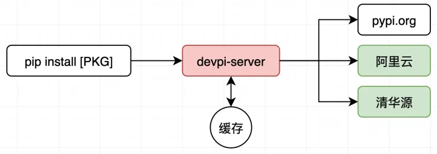
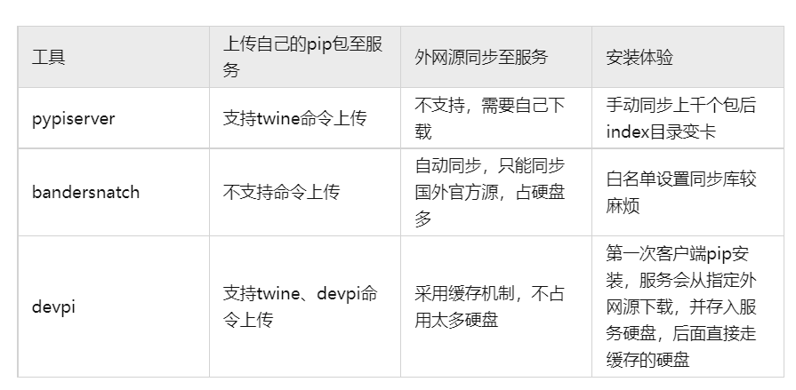
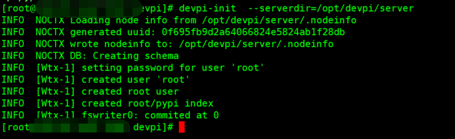
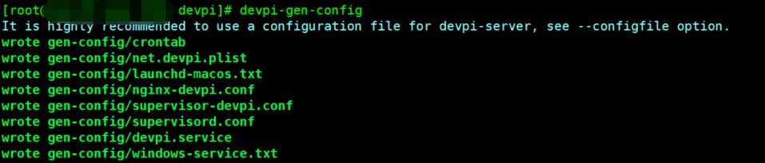
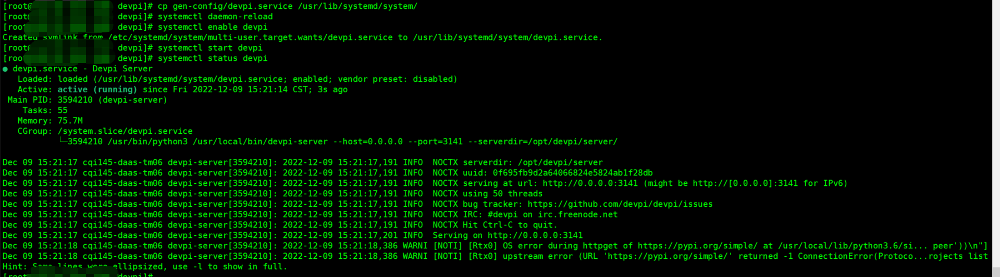
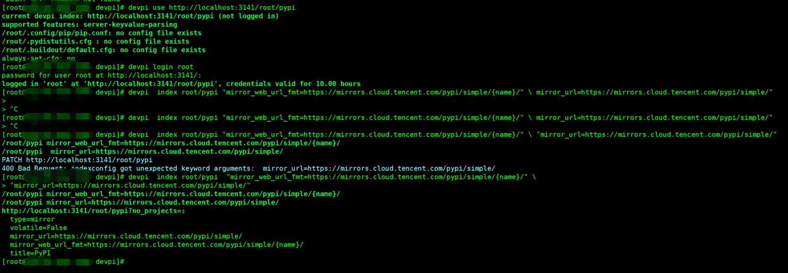
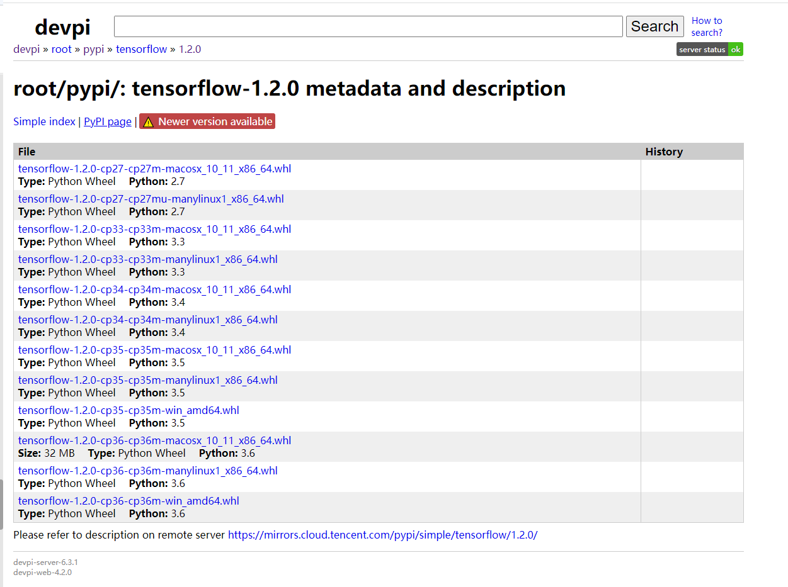
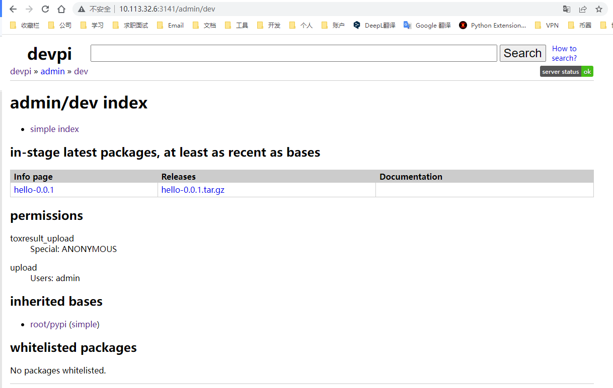

# Pip私有源
## 1.简要


*   devpi相比其他pypi源，有如下特点：

*   **节省硬盘**：不必完全同步下来公开源的所有包，仅在第一次pip安装时从公开源下载和缓存。
*   **支持上传接口文档**：上传自己开发pip库时，可以把接口文档也上传到devpi。


## 2.背景

### 2.1.为什么要自己搭建pypi源服务

1.  **节省安装时间**：当我们在内网打包镜像、安装python环境时，经常要**反复**从**外网源**下载pip库。即使改用国内的阿里源、豆瓣源，下载速度一般也只会在**2~7MB/s**左右，如果安装500MB的TensorFlow，下载+安装约需要2分钟。如果遇到网络不稳定，等待时间会更长，而从内网下载安装包，速度在**100+MB/s !!!**。
2.  **分享沉淀python库**：内部开发的python库，如果在内部pip源平台上，以pip库的形式内部分享，可以减少很多重复性工作，也可以沉淀工作内容。


### 2.2. pip源工具对比

比较试用了几款常见的pip源工具，选择**devpi**工具搭建



## 3.快速开始
首先创建安装目录,默认设置成为`/opt/devpi`:
```bash
mkdir /opt/devpi/
cd /opt/devpi/
```
然后升级pip3到最新版本:
```bash
python3 -m pip install --upgrade pip -i https://mirrors.aliyun.com/pypi/simple/
```
然后通过pip安装devpi，会附带安装devpi-server, devpi-web等依赖,默认使用阿里云镜像:
```bash
pip3 install devpi -i https://mirrors.aliyun.com/pypi/simple/
```

然后需要初始化devpi的配置和缓存安装包的文件夹。默认设置成`/opt/devpi/server`,如果不指定目录默认为`~/.devpi/server`。

```bash
devpi-init  --serverdir=/opt/devpi/server
```


然后生成`devpi`的配置:
```bash
devpi-gen-config
```


本文以`systemctl`管理`devpi`服务为例,修改`devpi.service`,添加host,port,serverdir参数:
```
vim gen-config/devpi.service
```
文件内容如下,具体的参数可以通过`devpi-server --help`查看。
```
[Unit]
Description=Devpi Server
Requires=network-online.target
After=network-online.target

[Service]
Restart=on-success
# ExecStart:
# - shall point to existing devpi-server executable
# - shall not use the deprecated `--start`. We want the devpi-server to start in foreground
ExecStart=/usr/local/bin/devpi-server --host=0.0.0.0 --port=3141 --serverdir=/opt/devpi/server/ --debug
# set User according to user which is able to run the devpi-server
User=root

[Install]
WantedBy=multi-user.target

```
host="0.0.0.0"表示可以接受任何IP的连接,默认端口是3141,`serverdir`是`/opt/devpi/server/`.

然后将`devpi.service`移动到system目录:
```bash
cp gen-config/devpi.service /usr/lib/systemd/system/
```

然后加载服务,设置成开启启动,启动服务查看服务状态.
```
# 加载服务
systemctl daemon-reload
# 开启启动devpi服务
systemctl enable devpi
# 启动devpi服务
systemctl start devpi
# 查看devpi服务的状态
systemctl status devpi
```



devpi有用户机制，默认用户为root 密码为空。每个用户可以创建多个index，index直接还可以继承，默认为root/pypi。可以使用devpi index [USER/INDEX]来查看index的配置详情。

第一次启动后，会自动从python官方源下载索引。这时需要修改root/pypi这个index中的配置，切换镜像源地址以腾讯云为例。首先需要选择index地址，然后用户登陆，默认密码为空，最后指定镜像的地址。（对于国外用户，这一步就省了，可以直接使用）


```bash
# devpi use http://[HOST]:[PORT]/root/pypi
devpi use http://localhost:3141/root/pypi

# 默认密码为空
devpi login root --password=''

# 设置镜像地址 
# 阿里云
# devpi  index root/pypi  "mirror_web_url_fmt=https://mirrors.aliyun.com/pypi/simple/{name}/" "mirror_url=https://mirrors.aliyun.com/pypi/simple/"

# 阿里云内网
# devpi  index root/pypi  "mirror_web_url_fmt=https://mirrors.cloud.aliyuncs.com/pypi/simple/{name}/" "mirror_url=https://mirrors.cloud.aliyuncs.com/pypi/simple/"

# 腾讯云
# devpi  index root/pypi  "mirror_web_url_fmt=https://mirrors.cloud.tencent.com/pypi/simple/{name}/" "mirror_url=https://mirrors.cloud.tencent.com/pypi/simple/"

# 默认设置成清华源
devpi  index root/pypi  "mirror_web_url_fmt=https://pypi.tuna.tsinghua.edu.cn/simple/{name}/" "mirror_url=https://pypi.tuna.tsinghua.edu.cn/simple"
```


替换之后devpi server会停止下载的原索引，转为从新的源下载。同步完成后，会删除旧索引，索引都在indices文件夹中，占有空间在400M左右。在server的日志中，可以看到下载队列的提示，也可以在网页上看到更新状态，地址为 http://[HOST]:[PORT]/root/pypi

在运行`devpi`的服务器上面创建用户名和密码，默认都是`admin`,然后登录,再创建一个“dev”索引，告诉它使用 root/pypi 缓存作为基础，以便所有 pypi.org 包都将出现在该索引上。这个索引是用来管理用户自定义包的。

```bash
# 创建用户名和密码，都是admin
devpi user -c admin password=admin

# 登录
devpi login admin --password=admin

# 创建新索引 dev
devpi index -c pypi bases=root/pypi
```

最终使用的`devpi`源的地址为：`http://[HOST]:[PORT]/admin/pypi/+simple/`

## 4.使用方法

### 4.1.命令行使用
```
# 示例 实际使用的时候将host和端口修改成自己的就行
pip3 --no-cache-dir install -i http://localhost:3141/admin/pypi/+simple/  --trusted-host localhost tensorflow==1.12 scikit-learn==0.19.1

```

### 4.2.pip config 配置

和使用阿里云/清华源一样，临时使用在pip install后添加 index_url 和 trusted_host，长期使用修改本地 pip.conf 文件，默认在`~/.pip/pip.conf`。

```
[global]
trusted-host=[HOST]
index-url=http://[HOST]:[PORT]/admin/pypi/
timeout=120
```


## 5.其他

### 5.1devpi的组成

虽然包名叫devpi，但在这个版本，功能已经被分为客户端 devpi-client 和服务端 devpi-server：

*   直接使用devpi的命令调用的是devpi-client，专门管理已经启动的服务（index，user等指令）
*   而devpi-server加参数用来启动服务器。只有先启动devpi服务，client才能控制（use指令）

不足的是，我目前还没有找到一步到位配置devpi的方法。首次启动服务器时，mirror_url不能通过config文件传递给程序，只能用上文方式登陆后再修改。但还好，只需要配置一次。这些配置文件会存放在server目录中的数据库文件。

另外一个组件是devpi-web，一个网页版客户端，和cli版本的功能互相补全（或者说两个客户端功能都残废）。网页地址和 index_url 相同。网页上可以搜索包名，点击对应版本的安装包可以直接下载。如果已经缓存过，描述中会显示文件大小，反之说明没有本地缓存。



另外，使用时可能会报错serial mismatch，导致devpi不用清华源而是官方源下载。这是因为该包的本地index过时，使用 `devpi refresh [PKG]`来刷新本地缓存，或者在网页中对应包的simple index界面，点击refresh按钮。

### 5.2.上传私有包

devpi 的 index有两种类型，mirror 和 stage，前者就是默认使用的，拉取远程镜像，但不能传文件到这个 index中。这时需要创建新的 index，指定 stage 类型。然后 devpi use 这个 index，再 devpi upload 本地包。（更多的操作例如本地发布包，也有对应的指令，这个我没有深究）当我下载时，devpi 会先搜索上传的包，如果没有找到依然能通过 mirror 的 index 来下载，则可以修改 bases，指向 root/pypi，这样就串联起来了。

#### 5.2.1创建项目:
首先需要保证有最新版的`setuptools`和`wheel`
```bash
pip3 install --upgrade setuptools wheel
```
如果出现问题了可以查看官网的解决方案：[https://packaging.python.org/tutorials/installing-packages/](https://packaging.python.org/tutorials/installing-packages/)

自定义项目上传到私有源,下面已一个hello为例.

新建一个`hello`的目录，里面新建setup.py，然后在hello目录下新建一个`hello`的packge编写代码.hello项目的目录如下：
```
|-- hello
|   |-- __init__.py
|   `-- main.py
`-- setup.py
```

main.py文件如下：
```python
def foo():
    print("Hello World")


if __name__ == '__main__':
    foo()

```
setpu.py文件如下：
```python
from setuptools import setup

setup(
    name='hello',
    version='0.0.1',
    description="测试打包hello",
    url="None",
    author="litao",
    author_email="Tao.Li67@geely.com",
    license="MIT",
    packages=["hello"]
)

```
然后用`python setup.py check`检查setup是否有问题,具体字段说明参见:

*   [https://setuptools.pypa.io/en/latest/userguide/index.html](https://setuptools.pypa.io/en/latest/userguide/index.html)
*   [花了两天，终于把 Python 的 setup.py 给整明白了](https://zhuanlan.zhihu.com/p/276461821)
*   [Python 库打包分发(setup.py 编写)简易指南](https://blog.konghy.cn/2018/04/29/setup-dot-py/)

### 5.2.2打包项目
```bash
# 检查
python setup.py check
# 进入到setup.py同级的目录下打包
python setup.py sdist bdist_wheel
```

打包之后会在`dist`目录自动创建一个`.whl`格式和一个`.tar.gz`格式的文件，文件名如下:
```
hello-0.0.1-py3-none-any.whl 
hello-0.0.1.tar.gz
```
### 5.2.3上传项目
首先要在Home目录下新建一个`.pypirc`的文件,内容如下.
```
[distutils]
index-servers = 
    pypi
    pypitest
    private
    devpi

[pypi]
repository: https://pypi.python.org/pypi 
username:
password:

[pypitest]
repository: https://testpypi.python.org/pypi
username:
password:

[devpi]
repository:http://your_ip:3141/admin/pypi/
username:admin
password:admin
```
其中index-servers后面写的就是pypi源的仓库名, 默认是pypi,
私有源需要暂时配置成`private`或`devpi`, 这个可以随便取名, 只要后下面的section对的上就行.
repository表示私有pypi源的http地址, 需要将IP设置成实际的IP.
username表示私有源的用户名, 
password表示私有源的密码.

上传到devpi私有源中
```bash
# -r后面是仓库的名称
python setup.py sdist upload -r devpi
```
执行结果显示ok就说明上传成功了
```
running sdist
running egg_info
writing hello.egg-info\PKG-INFO
writing dependency_links to hello.egg-info\dependency_links.txt
writing top-level names to hello.egg-info\top_level.txt
reading manifest file 'hello.egg-info\SOURCES.txt'
writing manifest file 'hello.egg-info\SOURCES.txt'
warning: sdist: standard file not found: should have one of README, README.rst,
README.txt, README.md

running check
creating hello-0.0.1
creating hello-0.0.1\hello
creating hello-0.0.1\hello.egg-info
copying files to hello-0.0.1...
copying setup.py -> hello-0.0.1
copying hello\__init__.py -> hello-0.0.1\hello
copying hello\main.py -> hello-0.0.1\hello
copying hello.egg-info\PKG-INFO -> hello-0.0.1\hello.egg-info
copying hello.egg-info\SOURCES.txt -> hello-0.0.1\hello.egg-info
copying hello.egg-info\dependency_links.txt -> hello-0.0.1\hello.egg-info
copying hello.egg-info\top_level.txt -> hello-0.0.1\hello.egg-info
Writing hello-0.0.1\setup.cfg
Creating tar archive
removing 'hello-0.0.1' (and everything under it)
running upload
Submitting dist\hello-0.0.1.tar.gz to http://10.113.32.6:3141/admin/pypi/
Server response (200): OK
```

可以打可网页查看结果:


### 5.2.4 验证自定义包
验证自定义包的安装
```bash
pip3 --no-cache-dir install -i http://localhost:3141/admin/dev/+simple/  --trusted-host localhost hello==0.0.1
```
验证自定义包的使用：
```
$ python
Python 3.9.13 | packaged by conda-forge | (main, May 27 2022, 16:50:36) [MSC v.1
929 64 bit (AMD64)] on win32
Type "help", "copyright", "credits" or "license" for more information.
>>> from hello import main
>>> main.foo()
Hello World
>>>

```


### 5.3.同类比较

*   pypi-server 是官方推荐的一个服务器，但主要用做上传私有包。上传方便，直接拷贝安装包到文件夹即可。但目前没查到缓存已下载包的方法，使用时和其他源是并列关系。
*   bendersnatch 功能也很强大，但会把源镜像的包全部同步到本地，需要大量存储空间。
*   devpi 下载次数越多，缓存命中率越高，安装速度越快。
*   更多同类比较参考

https://juejin.cn/post/6994380597535703053

* * *

具体指令可以在--help或者官网上查看文档，可以解决90%的问题。help 中的描述很全，但需要配合文档才知道具体填什么。官网文档写的很有操作性，但多少漏了细节，最后需要配合github的代码看。总的来说挺好，只用作缓存服务器绰绰有余了。

欢迎评论区讨论、提出建议和指正。

## 6.参考

*   [http://doc.devpi.net/](http://doc.devpi.net/)
*   [devpi/devpi: Python PyPi staging server and packaging, testing, release tool (github.com)](https://github.com/devpi/devpi)
*   [devpi搭建pip源服务器 - 博客 - 编程圈 (bianchengquan.com)](https://www.bianchengquan.com/article/602635.html)
*   [使用私有的PyPI仓库源突破网络限制 – 北凉柿子 (beiliangshizi.com)](http://www.beiliangshizi.com/%3Fp%3D556)
    [使用devpi来搭建缓存镜像源服务器 (daimajiaoliu.com)](https://daimajiaoliu.com/daima/4eee7659a900404)