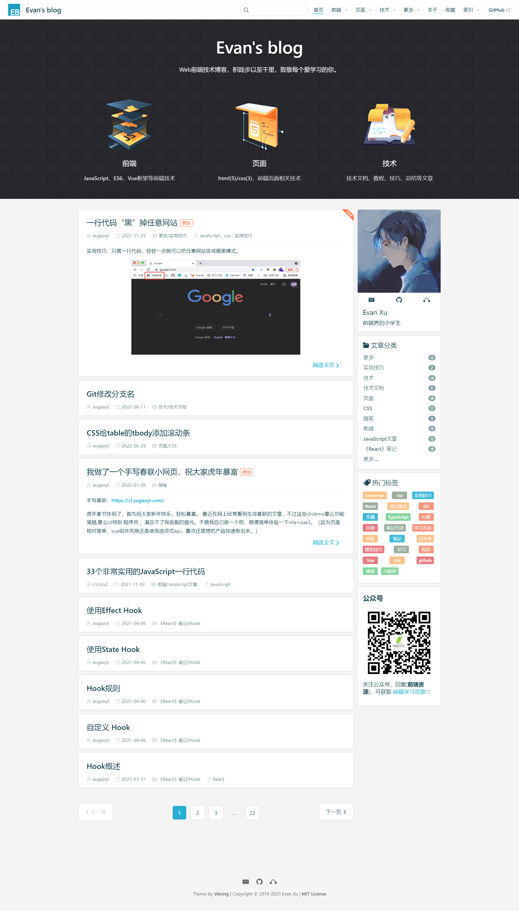
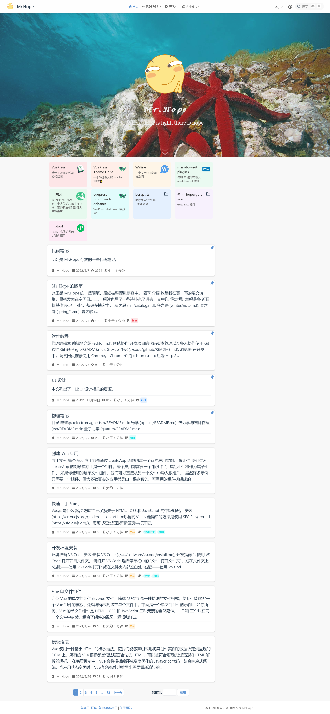
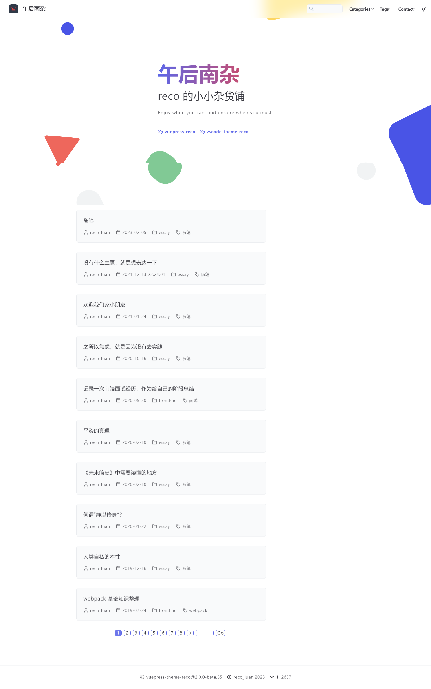
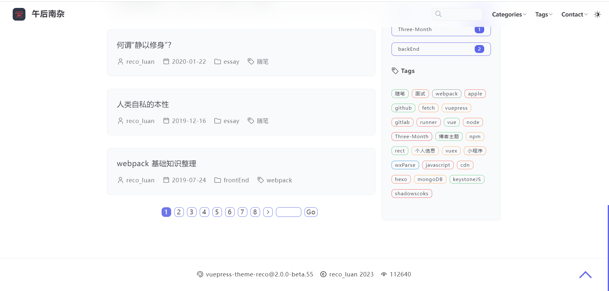
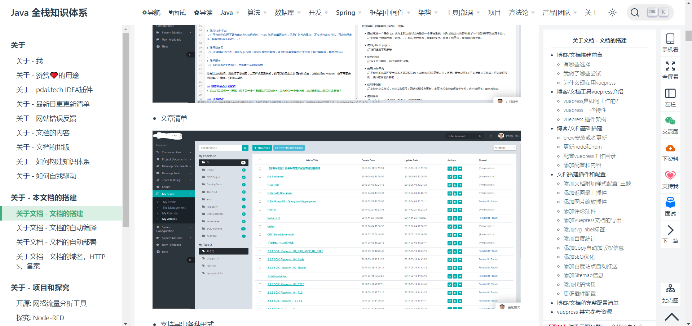

# vuepress主题

## vuepress-theme-vdoing

Github 地址: [https://github.com/xugaoyi/vuepress-theme-vdoing](https://github.com/xugaoyi/vuepress-theme-vdoing)

- star数量: 3.2k
- fork数量: 886
- issuse数量: 45/545
- PR 数量: 3/35
- commit 数量: 581
- 贡献人数: 13
- 使用人数 2.1k

-   上次更新: 2023-2-20

效果图如下:

## vuepress-theme-hope

Github 地址: https://github.com/vuepress-theme-hope/vuepress-theme-hope

- star数量: 1.1k
- fork数量: 448
- issuse数量: 17/512
- PR 数量: 4/2293 (大量合并是bot)
- commit 数量: 3526
- 贡献人数: 73
- 使用人数 2.1k

-   上次更新: 2023-04-17

-   作者是理论物理硕士

效果图如下

## vuepress-theme-reco

Github地址: https://github.com/vuepress-reco/vuepress-theme-reco-1.x

- star数量: 1.6k
- fork数量: 327
- issuse数量: 3/286
- PR 数量: 0/125
- commit 数量: 731
- 贡献人数: 23
- 使用人数 2.3k

-   上次更新: 2023-03-01

效果图如下

## vuepress-theme-reco

Github地址: https://github.com/vuepress-reco/vuepress-theme-reco

- star数量: 312
- fork数量: 76
- issuse数量:40/88
- PR 数量: 1/24
- commit 数量: 477
- 贡献人数: 1
- 使用人数 154

-   上次更新: 2023-04-15

效果图如下

## Java全站知识体系

地址:  https://pdai.tech/md/about/blog/blog-build-vuepress.html

自定义vuepress

效果图

